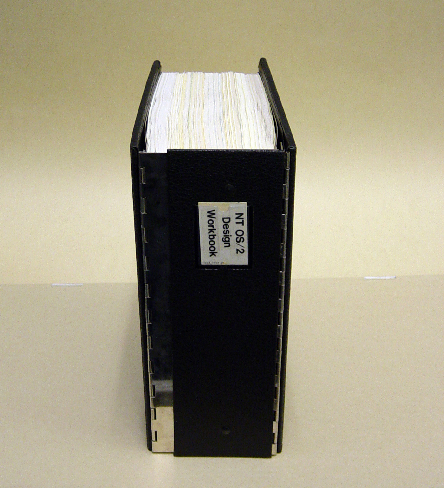

NT OS/2 Design Workbook
====================================



1\. Introduction
---------------

The **NT OS/2** system is a portable implementation of OS/2 developed in a high-level language.  The initial release of NT OS/2 is targeted for Intel 860-based hardware, which includes both personal computers (*Frazzle*) and servers (*Dazzle*).

The first systems based on a RISC microprocessor will be available for testing in the fall of 1990.

2\. Project Goals
----------------

The ultimate goal of the **NT OS/2** project is to develop a portable implementation of OS/2 executing on the Intel 860 and to establish this combination of hardware and software as the standard for high-performance personal computers and server systems.  

**NT OS/2** has the following overall project goals (though not all these goals will be attained by the first implementation of **NT OS/2**):

- Portability to a variety of hardware architectures.  Though the first implementation is targeted to the Intel 860, the overall system design isolates the machine-dependent portions for portability to other architectures.
- Support for multiple processors with shared memory via symmetric multiprocessing.  This provides performance improvements for multiprocessor workstations and servers.
- Compatibility with the OS/2 V2.0 32-bit application programming interface (API).  Because the initial target system is not an Intel x86 architecture, all applications will have to be recompiled and relinked.  In addition, any assembly language code will have to be rewritten or converted to a higher level language such as C.
- Security at the C2 level with future versions achieving higher levels of security.  This includes login/logout options on the personal computer and the server system, and declaration and enforcement of protection attributes for shareable  resources (files, IPC, memory objects, etc.).
- Support for a POSIX-compliant API interface that passes the POSIX validation suites.
- Support for internationalization.
- Support for LANMAN networking and management of personal computers and servers.
- Support for the current Presentation Manager API running in both the OS/2 environment and the POSIX environment.
- Support for distributed applications.  The network is integrated into the system to allow transparent distribution of applications and services within a network.
- Support for object-oriented file systems and object-oriented presentation manager.
- Easy extensibility by layering new features on the existing system without modifying the underlying system.
- Simultaneous execution by multiple users, each with a unique security profile.
- Interoperability and data interchange between OS/2 and POSIX applications.
- High reliability that prevents errant user programs from causing a system crash or exhausting system-wide resources. Resource quotas, a protected kernel, and protected objects are used to improve reliability.

3\. NT OS/2 Components
---------------------

**NT OS/2** consists of a highly integrated kernel / executive that executes in kernel mode.  It provides the necessary services to allow the emulation of OS/2 and POSIX APIs via protected subsystems executing in user mode.  Both the OS/2 and POSIX subsystems provide these services through remote procedure calls from a client to the server subsystem.  The server subsystem, in turn, emulates the desired operation locally or by calling the executive, and returns the results to the caller.  The following diagram illustrates the structure of **NT OS/2**.

```
           ╔══════════════╗ ╔══════════════╗
           ║ OS/2         ║ ║ POSIX        ║
           ║ Processes    ║ ║ Processes    ║
           ╚══════════════╝ ╚══════════════╝
                 ║       ║   ║      ║       
                 V       ║   ║      V       
             ╔═════════╗ ║   ║ ╔═════════╗  
             ║OS/2     ║ ║   ║ ║POSIX    ║  
             ║Subsystem║ ║   ║ ║Subsystem║  
             ╚═════════╝ ║   ║ ╚═════════╝  
                ║    ║   ║   ║  ║    ║      
                ║    V   V   V  V    ║      
╔═════════╗     ║  ╔═════════════╗   ║     ╔═══════════════╗
║ Session ║     ║  ║Presentation ║   ║     ║ Security      ║
║ Manager ║═>   ║  ║Manager      ║   ║  <═ ║ Authenticator ║ 
╚═════════╝     ║  ╚═════════════╝   ║     ╚═══════════════╝
   ║            ║        ║           ║                 ║               
   V            V        V           V                 V
User Mode
====================================================================
Kernel Mode
NT OS/2 Executive
╔═══════════════════════════════════════════════════════════════════╗
║                     NT OS/2 APIs                                  ║
╠═══════════════╦════════════╦════════════╦══════════════╦══════════╣
║ I/O           ║ Object     ║ Memory     ║Interprocess  ║ Process  ║
║ System        ║ Management ║ Management ║Communication ║ Structure║
╠═════════╗     ║            ║            ║              ║          ║
║ File    ║     ║            ║            ║              ║          ║
║ System  ║     ╠════════════╩════════════╩══════════════╩══════════╣
║ Devices ║     ║           Executive Support Routines              ║
╠═════════╩═════╩═══════════════════════╦═══════════════════════════╣
║   Device Drivers                      ║                           ║
║                      ╔════════════════╝                           ║
║                      ║                        Kernel              ║
╚══════════════════════╩════════════════════════════════════════════╝
```

**Block Diagram of NT OS/2**

4\. Functional Specifications
-----------------------------

The following specifications are contained within this design workbook.  Each specification contains an abstract of the component it describes, how that component fits into the system, the various APIs that are used to access the functionality, and enough detail to ensure the defined capability can be implemented.

The goal of the specifications is to allow someone to understand the functionality provided by a particular piece of the system. It is NOT a goal to describe the actual implementation. 